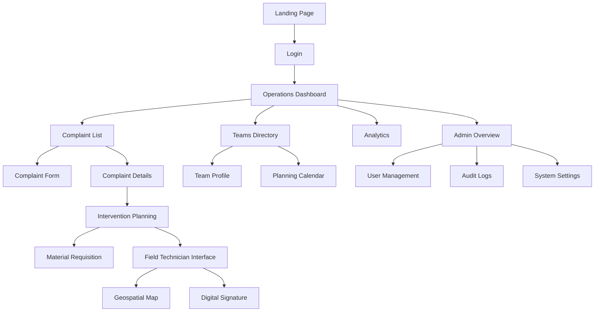

# 📊 Analyse d'Intégration des 39 Pages HTML
## Système de Gestion des Réclamations Municipales

**Date d'analyse:** 2026-02-08  
**Répertoire source:** `C:\Users\pc gold\Desktop\ticket\Nouveau dossier\ddd`  
**Nombre total de pages:** 39 pages HTML

---

## 🎯 Vue d'Ensemble

Ce document présente une analyse complète des 39 pages HTML du système de gestion des réclamations municipales, avec un plan d'harmonisation et d'intégration dans l'architecture ReclamTrack.

---

## 📁 Inventaire Complet des Pages

### 1. **Authentification & Accès** (2 pages)
| Page | Fichier | Rôle |
|------|---------|------|
| Connexion sécurisée | `secure_login_screen` | Point d'entrée principal du système |
| Page de présentation | `app_presentation_landing_page` | Landing page marketing |

### 2. **Gestion des Réclamations** (5 pages)
| Page | Fichier | Rôle |
|------|---------|------|
| Formulaire de soumission | `step-by-step_complaint_intake_form` | Création de réclamation (multi-étapes) |
| Liste avancée | `advanced_complaint_list_view` | Vue tableau avec filtres |
| Détails de réclamation | `detailed_complaint_ticket_view` | Vue détaillée d'un ticket |
| Portail citoyen | `citizen_feedback_portal` | Interface publique |
| Dashboard satisfaction | `citizen_satisfaction_dashboard` | Métriques de satisfaction |

### 3. **Dashboards & Opérations** (4 pages)
| Page | Fichier | Rôle |
|------|---------|------|
| Dashboard opérations | `operations_management_dashboard` | Vue d'ensemble opérationnelle |
| Analytics opérationnels | `operational_analytics_dashboard` | Métriques et KPIs |
| Vue admin système | `system_admin_overview` | Monitoring système |
| Informations système | `system_information_&_process_flow` | Documentation processus |

### 4. **Gestion des Équipes** (6 pages)
| Page | Fichier | Rôle |
|------|---------|------|
| Annuaire équipes | `technical_teams_directory` | Liste des équipes techniques |
| Profil équipe | `technical_team_profile_details` | Détails d'une équipe |
| Planning interventions | `intervention_planning_calendar` | Calendrier des interventions |
| Planification horaires | `team_shift_&_roster_scheduler` | Gestion des rotations |
| Interface mobile technicien | `field_technician_mobile_interface` | App mobile terrain |
| Messagerie interne | `internal_team_messaging_hub` | Chat d'équipe |

### 5. **Cartographie & Géolocalisation** (2 pages)
| Page | Fichier | Rôle |
|------|---------|------|
| Carte opérations | `geospatial_operations_map` | Carte interactive des interventions |
| Heatmap infrastructure | `infrastructure_issue_heatmap` | Visualisation des zones problématiques |

### 6. **Gestion des Stocks & Matériel** (5 pages)
| Page | Fichier | Rôle |
|------|---------|------|
| Inventaire 1 | `inventory_&_stock_management_1` | Gestion stocks principal |
| Inventaire 2 | `inventory_&_stock_management_2` | Vue alternative stocks |
| Formulaire réquisition | `material_requisition_form` | Demande de matériel |
| Portail approbation | `warehouse_request_approval_portal` | Validation demandes |
| Suivi coûts | `intervention_cost_tracking` | Comptabilité interventions |

### 7. **Gestion Documentaire** (3 pages)
| Page | Fichier | Rôle |
|------|---------|------|
| Galerie documents | `document_&_media_gallery` | Bibliothèque de fichiers |
| Base de connaissances | `internal_knowledge_base_&_sops` | Procédures et SOPs |
| Rapports & archives | `reporting_&_data_archiving` | Génération de rapports |

### 8. **Administration & Configuration** (5 pages)
| Page | Fichier | Rôle |
|------|---------|------|
| Gestion utilisateurs | `user_&_roles_management` | CRUD utilisateurs et rôles |
| Paramètres compte | `user_account_settings` | Profil utilisateur |
| Configuration services | `service_category_configuration` | Types de services |
| Paramètres notifications | `notification_&_alert_settings` | Préférences alertes |
| Logs d'audit | `audit_logs_&_activity_feed` | Traçabilité système |

### 9. **Intégrations & Flotte** (3 pages)
| Page | Fichier | Rôle |
|------|---------|------|
| Hub intégrations | `external_integration_hub` | APIs externes |
| Monitoring véhicules | `vehicle_fleet_monitoring` | Suivi flotte |
| Signature digitale | `digital_signature_confirmation` | Validation électronique |

### 10. **E-commerce / Abonnements** (4 pages)
| Page | Fichier | Rôle |
|------|---------|------|
| Plans tarifaires 1 | `subscription_plans_pricing_1` | Offres d'abonnement |
| Plans tarifaires 2 | `subscription_plans_pricing_2` | Vue alternative pricing |
| Panier | `order_summary_&_cart` | Récapitulatif commande |
| Paiement sécurisé | `secure_checkout_interface` | Processus de paiement |

---

## 🎨 Analyse du Design System

### Cohérence Visuelle

#### ✅ **Points Communs Identifiés**

```css
/* Palette de couleurs unifiée */
--primary: #2424eb (Bleu primaire)
--background-light: #f6f6f8
--background-dark: #111121
--status-new: #2424eb
--status-progress: #f59e0b
--status-resolved: #10b981
--status-urgent: #ef4444
```

#### 📐 **Typographie**
- **Police principale:** Inter (Google Fonts)
- **Poids utilisés:** 300, 400, 500, 600, 700, 800, 900
- **Icônes:** Material Symbols Outlined

#### 🎯 **Framework CSS**
- **TailwindCSS** via CDN
- **Dark Mode:** Classe `dark` (toggle manuel)
- **Border Radius:** Standardisé (0.25rem, 0.5rem, 0.75rem, 1rem, 1.5rem)

---

## 🔗 Cartographie des Relations Entre Pages

### Flux Utilisateur Principal



### Relations de Navigation

| Page Source | Pages Liées | Type de Relation |
|-------------|-------------|------------------|
| `operations_management_dashboard` | `advanced_complaint_list_view`, `technical_teams_directory`, `intervention_planning_calendar` | Navigation principale |
| `advanced_complaint_list_view` | `detailed_complaint_ticket_view`, `step-by-step_complaint_intake_form` | CRUD réclamations |
| `detailed_complaint_ticket_view` | `intervention_planning_calendar`, `technical_teams_directory`, `geospatial_operations_map` | Workflow intervention |
| `technical_teams_directory` | `technical_team_profile_details`, `team_shift_&_roster_scheduler` | Gestion équipes |
| `intervention_planning_calendar` | `material_requisition_form`, `field_technician_mobile_interface` | Planification |
| `system_admin_overview` | `user_&_roles_management`, `audit_logs_&_activity_feed`, `service_category_configuration` | Administration |

---

## ⚠️ Problèmes Identifiés

### 1. **Navigation Fragmentée**
- ❌ Tous les liens sont `href="#"` (aucune navigation réelle)
- ❌ Pas de routing cohérent
- ❌ Pas de breadcrumbs

### 2. **Duplication de Contenu**
- 🔄 `inventory_&_stock_management_1` vs `inventory_&_stock_management_2`
- 🔄 `subscription_plans_pricing_1` vs `subscription_plans_pricing_2`

### 3. **Incohérences de Structure**
- ⚠️ Headers différents entre pages
- ⚠️ Sidebars présentes sur certaines pages uniquement
- ⚠️ Footers manquants sur plusieurs pages

### 4. **Absence de Composants Réutilisables**
- ❌ Code HTML dupliqué (headers, sidebars, cards)
- ❌ Pas de système de composants

### 5. **Gestion d'État**
- ❌ Pas de gestion d'authentification
- ❌ Pas de persistance de données
- ❌ Pas de communication avec backend

---

## 🛠️ Plan d'Harmonisation

### Phase 1: Architecture & Routing ✅

#### 1.1 Structure de Dossiers Proposée

```
reclamtrack/
├── frontend/
│   ├── src/
│   │   ├── app/
│   │   │   ├── (auth)/
│   │   │   │   ├── login/
│   │   │   │   └── register/
│   │   │   ├── (public)/
│   │   │   │   ├── landing/
│   │   │   │   └── citizen-portal/
│   │   │   ├── (dashboard)/
│   │   │   │   ├── operations/
│   │   │   │   ├── analytics/
│   │   │   │   └── admin/
│   │   │   ├── complaints/
│   │   │   │   ├── list/
│   │   │   │   ├── create/
│   │   │   │   └── [id]/
│   │   │   ├── teams/
│   │   │   │   ├── directory/
│   │   │   │   ├── [id]/
│   │   │   │   └── planning/
│   │   │   ├── inventory/
│   │   │   │   ├── stock/
│   │   │   │   ├── requisition/
│   │   │   │   └── approval/
│   │   │   ├── maps/
│   │   │   │   ├── operations/
│   │   │   │   └── heatmap/
│   │   │   ├── admin/
│   │   │   │   ├── users/
│   │   │   │   ├── settings/
│   │   │   │   ├── audit-logs/
│   │   │   │   └── system/
│   │   │   └── mobile/
│   │   │       └── field-tech/
│   │   ├── components/
│   │   │   ├── layout/
│   │   │   │   ├── Header.tsx
│   │   │   │   ├── Sidebar.tsx
│   │   │   │   ├── Footer.tsx
│   │   │   │   └── MobileNav.tsx
│   │   │   ├── ui/
│   │   │   │   ├── Button.tsx
│   │   │   │   ├── Card.tsx
│   │   │   │   ├── Table.tsx
│   │   │   │   ├── Modal.tsx
│   │   │   │   └── Badge.tsx
│   │   │   ├── complaints/
│   │   │   │   ├── ComplaintCard.tsx
│   │   │   │   ├── ComplaintForm.tsx
│   │   │   │   └── StatusBadge.tsx
│   │   │   ├── teams/
│   │   │   │   ├── TeamCard.tsx
│   │   │   │   └── TeamMemberList.tsx
│   │   │   └── maps/
│   │   │       ├── MapView.tsx
│   │   │       └── HeatmapLayer.tsx
│   │   ├── lib/
│   │   │   ├── api/
│   │   │   ├── utils/
│   │   │   └── constants/
│   │   └── store/
│   │       ├── authStore.ts
│   │       ├── complaintStore.ts
│   │       └── teamStore.ts
```

#### 1.2 Routes Mapping

| Page HTML Originale | Route Next.js | Groupe de Layout |
|---------------------|---------------|------------------|
| `secure_login_screen` | `/login` | `(auth)` |
| `app_presentation_landing_page` | `/` | `(public)` |
| `operations_management_dashboard` | `/dashboard/operations` | `(dashboard)` |
| `advanced_complaint_list_view` | `/complaints/list` | `(dashboard)` |
| `step-by-step_complaint_intake_form` | `/complaints/create` | `(dashboard)` |
| `detailed_complaint_ticket_view` | `/complaints/[id]` | `(dashboard)` |
| `technical_teams_directory` | `/teams/directory` | `(dashboard)` |
| `technical_team_profile_details` | `/teams/[id]` | `(dashboard)` |
| `intervention_planning_calendar` | `/teams/planning` | `(dashboard)` |
| `geospatial_operations_map` | `/maps/operations` | `(dashboard)` |
| `infrastructure_issue_heatmap` | `/maps/heatmap` | `(dashboard)` |
| `inventory_&_stock_management_1` | `/inventory/stock` | `(dashboard)` |
| `material_requisition_form` | `/inventory/requisition` | `(dashboard)` |
| `warehouse_request_approval_portal` | `/inventory/approval` | `(dashboard)` |
| `system_admin_overview` | `/admin/system` | `(dashboard)` |
| `user_&_roles_management` | `/admin/users` | `(dashboard)` |
| `audit_logs_&_activity_feed` | `/admin/audit-logs` | `(dashboard)` |
| `field_technician_mobile_interface` | `/mobile/field-tech` | `(mobile)` |

### Phase 2: Extraction de Composants Réutilisables 🔧

#### 2.1 Composants de Layout

**Header Component**
```tsx
// components/layout/Header.tsx
interface HeaderProps {
  user?: User;
  showSearch?: boolean;
  notifications?: Notification[];
}

export function Header({ user, showSearch, notifications }: HeaderProps) {
  // Extrait de operations_management_dashboard, system_admin_overview, etc.
}
```

**Sidebar Navigation**
```tsx
// components/layout/Sidebar.tsx
interface SidebarProps {
  activeRoute: string;
  userRole: 'admin' | 'operator' | 'technician';
}

export function Sidebar({ activeRoute, userRole }: SidebarProps) {
  // Navigation contextuelle selon le rôle
}
```

#### 2.2 Composants UI Communs

**Status Badge**
```tsx
// components/ui/StatusBadge.tsx
type Status = 'new' | 'in-progress' | 'resolved' | 'urgent';

interface StatusBadgeProps {
  status: Status;
  size?: 'sm' | 'md' | 'lg';
}
```

**KPI Card**
```tsx
// components/ui/KPICard.tsx
interface KPICardProps {
  title: string;
  value: string | number;
  icon: string;
  trend?: { value: string; direction: 'up' | 'down' };
  color?: string;
}
```

**Data Table**
```tsx
// components/ui/DataTable.tsx
interface DataTableProps<T> {
  data: T[];
  columns: Column<T>[];
  onRowClick?: (row: T) => void;
  pagination?: boolean;
}
```

### Phase 3: Intégration Backend 🔌

#### 3.1 API Endpoints Requis

```typescript
// lib/api/complaints.ts
export const complaintAPI = {
  getAll: () => GET('/api/complaints'),
  getById: (id: string) => GET(`/api/complaints/${id}`),
  create: (data: ComplaintCreateDTO) => POST('/api/complaints', data),
  update: (id: string, data: ComplaintUpdateDTO) => PUT(`/api/complaints/${id}`, data),
  delete: (id: string) => DELETE(`/api/complaints/${id}`),
  assignTeam: (id: string, teamId: string) => POST(`/api/complaints/${id}/assign`, { teamId }),
};

// lib/api/teams.ts
export const teamAPI = {
  getAll: () => GET('/api/teams'),
  getById: (id: string) => GET(`/api/teams/${id}`),
  getSchedule: (teamId: string) => GET(`/api/teams/${teamId}/schedule`),
  updateSchedule: (teamId: string, schedule: Schedule) => PUT(`/api/teams/${teamId}/schedule`, schedule),
};

// lib/api/inventory.ts
export const inventoryAPI = {
  getStock: () => GET('/api/inventory/stock'),
  createRequisition: (data: RequisitionDTO) => POST('/api/inventory/requisitions', data),
  approveRequisition: (id: string) => POST(`/api/inventory/requisitions/${id}/approve`),
};
```

#### 3.2 State Management (Zustand)

```typescript
// store/complaintStore.ts
interface ComplaintStore {
  complaints: Complaint[];
  selectedComplaint: Complaint | null;
  filters: ComplaintFilters;
  
  fetchComplaints: () => Promise<void>;
  selectComplaint: (id: string) => void;
  createComplaint: (data: ComplaintCreateDTO) => Promise<void>;
  updateFilters: (filters: Partial<ComplaintFilters>) => void;
}

// store/teamStore.ts
interface TeamStore {
  teams: Team[];
  selectedTeam: Team | null;
  schedule: Schedule | null;
  
  fetchTeams: () => Promise<void>;
  selectTeam: (id: string) => void;
  updateSchedule: (teamId: string, schedule: Schedule) => Promise<void>;
}
```

### Phase 4: Harmonisation du Design 🎨

#### 4.1 Design Tokens Centralisés

```css
/* styles/design-tokens.css */
:root {
  /* Colors */
  --color-primary: #2424eb;
  --color-primary-light: #3d3dff;
  --color-primary-dark: #1a1ab8;
  
  --color-success: #10b981;
  --color-warning: #f59e0b;
  --color-error: #ef4444;
  --color-info: #3b82f6;
  
  /* Status Colors */
  --status-new: #2424eb;
  --status-progress: #f59e0b;
  --status-resolved: #10b981;
  --status-urgent: #ef4444;
  
  /* Backgrounds */
  --bg-light: #f6f6f8;
  --bg-dark: #111121;
  --bg-card-light: #ffffff;
  --bg-card-dark: #1e1e2e;
  
  /* Typography */
  --font-display: 'Inter', sans-serif;
  --font-mono: 'JetBrains Mono', monospace;
  
  /* Spacing */
  --spacing-xs: 0.25rem;
  --spacing-sm: 0.5rem;
  --spacing-md: 1rem;
  --spacing-lg: 1.5rem;
  --spacing-xl: 2rem;
  
  /* Border Radius */
  --radius-sm: 0.25rem;
  --radius-md: 0.5rem;
  --radius-lg: 1rem;
  --radius-xl: 1.5rem;
  --radius-full: 9999px;
  
  /* Shadows */
  --shadow-sm: 0 1px 2px 0 rgb(0 0 0 / 0.05);
  --shadow-md: 0 4px 6px -1px rgb(0 0 0 / 0.1);
  --shadow-lg: 0 10px 15px -3px rgb(0 0 0 / 0.1);
  --shadow-xl: 0 20px 25px -5px rgb(0 0 0 / 0.1);
}
```

#### 4.2 Composants Tailwind Personnalisés

```javascript
// tailwind.config.js
module.exports = {
  theme: {
    extend: {
      colors: {
        primary: {
          DEFAULT: '#2424eb',
          light: '#3d3dff',
          dark: '#1a1ab8',
        },
        status: {
          new: '#2424eb',
          progress: '#f59e0b',
          resolved: '#10b981',
          urgent: '#ef4444',
        },
      },
      fontFamily: {
        display: ['Inter', 'sans-serif'],
        mono: ['JetBrains Mono', 'monospace'],
      },
    },
  },
  plugins: [
    require('@tailwindcss/forms'),
    require('@tailwindcss/typography'),
  ],
};
```

### Phase 5: Fonctionnalités Manquantes à Implémenter 🚀

#### 5.1 Authentification & Autorisation
- [ ] Login/Logout avec JWT
- [ ] Gestion des rôles (Admin, Operator, Technician, Citizen)
- [ ] Protected routes
- [ ] Session persistence
- [ ] Password reset flow

#### 5.2 Temps Réel
- [ ] WebSocket pour notifications live
- [ ] Mise à jour en temps réel des statuts
- [ ] Chat d'équipe (Socket.io)
- [ ] Tracking GPS des techniciens

#### 5.3 Cartographie
- [ ] Intégration Leaflet/Mapbox
- [ ] Géolocalisation des réclamations
- [ ] Heatmap des zones problématiques
- [ ] Routing pour les techniciens

#### 5.4 Gestion de Fichiers
- [ ] Upload de photos/documents
- [ ] Galerie média
- [ ] Signature digitale
- [ ] Export PDF des rapports

#### 5.5 Analytics & Reporting
- [ ] Dashboards interactifs (Chart.js/Recharts)
- [ ] Export Excel/CSV
- [ ] Rapports planifiés
- [ ] Métriques de performance

---

## 📋 Checklist d'Intégration

### Étape 1: Préparation
- [ ] Créer la structure de dossiers Next.js
- [ ] Configurer Tailwind avec design tokens
- [ ] Installer dépendances (Zustand, React Query, etc.)
- [ ] Configurer ESLint/Prettier

### Étape 2: Composants de Base
- [ ] Créer Header component
- [ ] Créer Sidebar component
- [ ] Créer Footer component
- [ ] Créer composants UI (Button, Card, Badge, etc.)

### Étape 3: Pages Prioritaires (MVP)
- [ ] Login page
- [ ] Operations Dashboard
- [ ] Complaint List
- [ ] Complaint Create Form
- [ ] Complaint Details
- [ ] Teams Directory

### Étape 4: Intégration Backend
- [ ] Configurer API routes
- [ ] Implémenter authentification
- [ ] Connecter stores Zustand
- [ ] Tester CRUD operations

### Étape 5: Pages Secondaires
- [ ] Admin pages
- [ ] Inventory pages
- [ ] Maps pages
- [ ] Mobile interface

### Étape 6: Fonctionnalités Avancées
- [ ] WebSocket notifications
- [ ] File uploads
- [ ] Real-time updates
- [ ] Analytics dashboards

### Étape 7: Tests & Optimisation
- [ ] Tests unitaires (Jest)
- [ ] Tests E2E (Playwright)
- [ ] Performance optimization
- [ ] Accessibility audit

### Étape 8: Déploiement
- [ ] Build production
- [ ] Configuration environnement
- [ ] Déploiement backend
- [ ] Déploiement frontend
- [ ] Monitoring & logs

---

## 🔄 Stratégie de Migration Progressive

### Approche Recommandée: **Strangler Fig Pattern**

1. **Coexistence** (Semaines 1-2)
   - Garder les pages HTML statiques
   - Créer les routes Next.js en parallèle
   - Tester la navigation

2. **Migration Graduelle** (Semaines 3-6)
   - Migrer page par page
   - Commencer par les pages simples (login, landing)
   - Puis les pages complexes (dashboards)

3. **Intégration Backend** (Semaines 7-10)
   - Connecter les APIs
   - Implémenter la logique métier
   - Tests d'intégration

4. **Finalisation** (Semaines 11-12)
   - Supprimer les pages HTML statiques
   - Optimisation performance
   - Documentation

---

## 📊 Métriques de Succès

### KPIs Techniques
- ✅ 100% des pages migrées
- ✅ Temps de chargement < 2s
- ✅ Score Lighthouse > 90
- ✅ 0 erreurs console
- ✅ Couverture tests > 80%

### KPIs Utilisateur
- ✅ Navigation fluide entre pages
- ✅ Cohérence visuelle totale
- ✅ Responsive sur mobile/tablet/desktop
- ✅ Accessibilité WCAG 2.1 AA

---

## 🎯 Prochaines Actions Immédiates

### Priorité 1 (Cette semaine)
1. ✅ Créer la structure de dossiers Next.js
2. ✅ Extraire le Header component
3. ✅ Extraire le Sidebar component
4. ✅ Migrer la page de login
5. ✅ Migrer le dashboard operations

### Priorité 2 (Semaine prochaine)
1. ⏳ Créer les composants UI de base
2. ⏳ Migrer la liste des réclamations
3. ⏳ Migrer le formulaire de création
4. ⏳ Connecter l'API backend
5. ⏳ Implémenter l'authentification

### Priorité 3 (Semaines suivantes)
1. ⏳ Migrer toutes les pages restantes
2. ⏳ Implémenter les fonctionnalités temps réel
3. ⏳ Ajouter la cartographie
4. ⏳ Tests complets
5. ⏳ Déploiement production

---

## 📝 Notes Importantes

### Décisions Architecturales

1. **Framework:** Next.js 14 (App Router)
   - Raison: SSR, routing file-based, optimisations automatiques

2. **State Management:** Zustand
   - Raison: Simple, performant, moins verbeux que Redux

3. **Styling:** Tailwind CSS
   - Raison: Déjà utilisé dans les pages HTML, cohérence

4. **API Communication:** React Query
   - Raison: Cache automatique, retry logic, optimistic updates

5. **Maps:** Leaflet
   - Raison: Open-source, performant, extensible

6. **Real-time:** Socket.io
   - Raison: Fiable, fallback automatique, rooms support

### Risques Identifiés

| Risque | Impact | Probabilité | Mitigation |
|--------|--------|-------------|------------|
| Duplication de code | Moyen | Haute | Extraction systématique de composants |
| Incohérences UI | Élevé | Moyenne | Design system strict |
| Performance maps | Élevé | Moyenne | Lazy loading, clustering |
| Complexité routing | Moyen | Faible | Documentation claire |
| Bugs migration | Élevé | Haute | Tests E2E complets |

---

## 📚 Ressources & Documentation

### Documentation Technique
- [Next.js App Router](https://nextjs.org/docs/app)
- [Tailwind CSS](https://tailwindcss.com/docs)
- [Zustand](https://docs.pmnd.rs/zustand)
- [React Query](https://tanstack.com/query/latest)
- [Leaflet](https://leafletjs.com/reference.html)

### Design References
- [Material Design 3](https://m3.material.io/)
- [Tailwind UI](https://tailwindui.com/)
- [Shadcn/ui](https://ui.shadcn.com/)

---

## ✅ Conclusion

Ce document fournit une feuille de route complète pour harmoniser et intégrer les 39 pages HTML dans l'architecture ReclamTrack. L'approche progressive permet de minimiser les risques tout en assurant une migration réussie.

**Estimation totale:** 10-12 semaines  
**Équipe recommandée:** 2-3 développeurs full-stack  
**Budget estimé:** À définir selon les ressources

---

**Document créé le:** 2026-02-08  
**Dernière mise à jour:** 2026-02-08  
**Auteur:** Antigravity AI Assistant  
**Version:** 1.0
