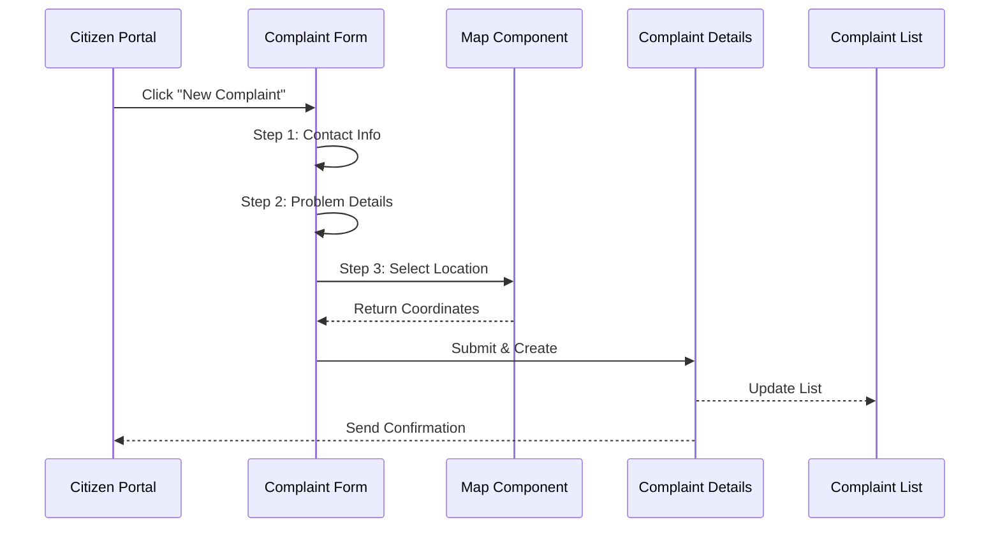
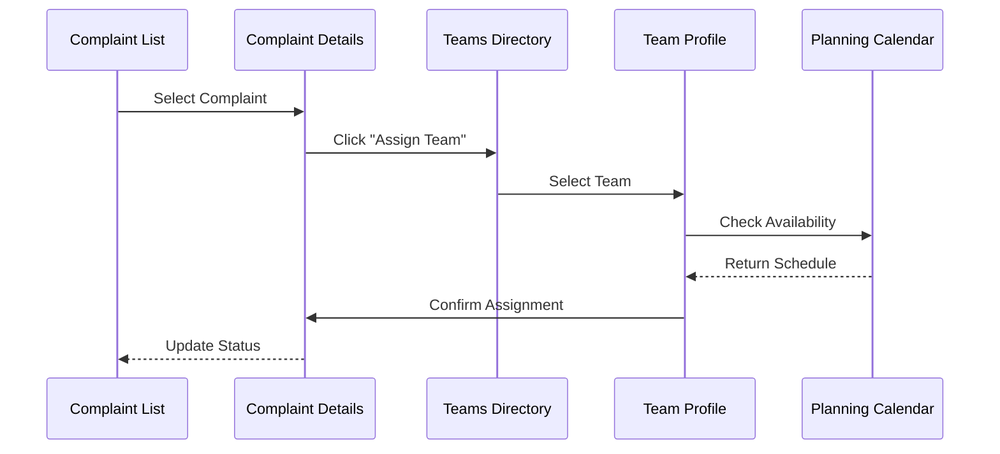
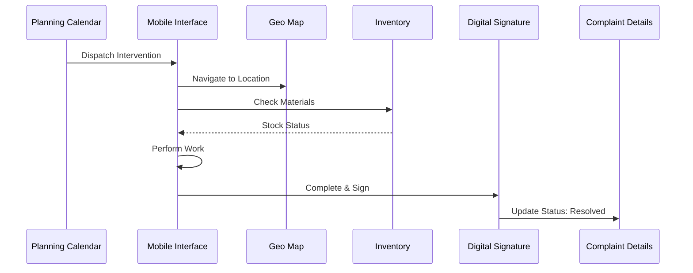

# 🔗 Cartographie Détaillée des Relations Entre Pages

## Vue d'Ensemble des Flux Utilisateur

### 🎯 Flux Principal: Gestion de Réclamation (Citizen → Resolution)

```
┌─────────────────────────────────────────────────────────────────┐
│                    FLUX CITOYEN → RÉSOLUTION                     │
└─────────────────────────────────────────────────────────────────┘

1. SOUMISSION
   app_presentation_landing_page
   ↓
   citizen_feedback_portal
   ↓
   step-by-step_complaint_intake_form
   ↓ [Submit]
   detailed_complaint_ticket_view (Confirmation)

2. TRAITEMENT OPÉRATIONNEL
   operations_management_dashboard (Notification)
   ↓
   advanced_complaint_list_view (Triage)
   ↓
   detailed_complaint_ticket_view (Analyse)
   ↓ [Assign Team]
   technical_teams_directory
   ↓
   technical_team_profile_details
   ↓ [Create Intervention]
   intervention_planning_calendar

3. INTERVENTION TERRAIN
   intervention_planning_calendar
   ↓ [Check Materials]
   inventory_&_stock_management_1
   ↓ [Request Materials]
   material_requisition_form
   ↓ [Approval]
   warehouse_request_approval_portal
   ↓ [Dispatch]
   field_technician_mobile_interface
   ↓ [Navigate]
   geospatial_operations_map
   ↓ [Complete Work]
   digital_signature_confirmation
   ↓ [Close Ticket]
   detailed_complaint_ticket_view (Status: Resolved)

4. FEEDBACK & ANALYTICS
   citizen_satisfaction_dashboard
   ↓
   operational_analytics_dashboard
   ↓
   reporting_&_data_archiving
```

---

## 📊 Matrice de Relations Inter-Pages

| Page Source | Pages Accessibles | Type de Lien | Données Partagées |
|-------------|-------------------|--------------|-------------------|
| **app_presentation_landing_page** | secure_login_screen, citizen_feedback_portal, subscription_plans_pricing_1 | Navigation | - |
| **secure_login_screen** | operations_management_dashboard, system_admin_overview | Auth redirect | User session |
| **operations_management_dashboard** | advanced_complaint_list_view, technical_teams_directory, intervention_planning_calendar, operational_analytics_dashboard, geospatial_operations_map | Main nav | Dashboard filters |
| **advanced_complaint_list_view** | detailed_complaint_ticket_view, step-by-step_complaint_intake_form | CRUD | Complaint filters |
| **detailed_complaint_ticket_view** | technical_teams_directory, intervention_planning_calendar, geospatial_operations_map, document_&_media_gallery, audit_logs_&_activity_feed | Contextual | Complaint ID |
| **step-by-step_complaint_intake_form** | geospatial_operations_map, document_&_media_gallery, detailed_complaint_ticket_view | Form flow | Form data |
| **technical_teams_directory** | technical_team_profile_details, team_shift_&_roster_scheduler, internal_team_messaging_hub | Team mgmt | Team filters |
| **technical_team_profile_details** | intervention_planning_calendar, team_shift_&_roster_scheduler, vehicle_fleet_monitoring, internal_team_messaging_hub | Team details | Team ID |
| **intervention_planning_calendar** | detailed_complaint_ticket_view, technical_team_profile_details, material_requisition_form, field_technician_mobile_interface, intervention_cost_tracking | Planning | Date range |
| **inventory_&_stock_management_1** | material_requisition_form, warehouse_request_approval_portal, intervention_cost_tracking | Inventory | Stock levels |
| **material_requisition_form** | warehouse_request_approval_portal, inventory_&_stock_management_1 | Request flow | Requisition data |
| **warehouse_request_approval_portal** | material_requisition_form, inventory_&_stock_management_1, audit_logs_&_activity_feed | Approval | Request ID |
| **field_technician_mobile_interface** | geospatial_operations_map, detailed_complaint_ticket_view, digital_signature_confirmation, document_&_media_gallery | Mobile workflow | Intervention ID |
| **geospatial_operations_map** | detailed_complaint_ticket_view, infrastructure_issue_heatmap, field_technician_mobile_interface | Map view | Coordinates |
| **infrastructure_issue_heatmap** | geospatial_operations_map, operational_analytics_dashboard, advanced_complaint_list_view | Analytics | Geographic data |
| **system_admin_overview** | user_&_roles_management, audit_logs_&_activity_feed, service_category_configuration, notification_&_alert_settings, external_integration_hub | Admin nav | System metrics |
| **user_&_roles_management** | user_account_settings, audit_logs_&_activity_feed | User admin | User filters |
| **audit_logs_&_activity_feed** | detailed_complaint_ticket_view, user_&_roles_management, system_admin_overview | Audit trail | Log filters |
| **citizen_satisfaction_dashboard** | citizen_feedback_portal, detailed_complaint_ticket_view, operational_analytics_dashboard | Feedback | Survey data |
| **operational_analytics_dashboard** | operations_management_dashboard, reporting_&_data_archiving, infrastructure_issue_heatmap | Analytics | Date range |
| **reporting_&_data_archiving** | operational_analytics_dashboard, audit_logs_&_activity_feed | Reports | Report params |
| **document_&_media_gallery** | detailed_complaint_ticket_view, field_technician_mobile_interface, internal_knowledge_base_&_sops | Documents | File filters |
| **internal_knowledge_base_&_sops** | document_&_media_gallery, system_information_&_process_flow | Knowledge | Search query |
| **internal_team_messaging_hub** | technical_team_profile_details, field_technician_mobile_interface | Chat | Team/User ID |
| **vehicle_fleet_monitoring** | technical_team_profile_details, geospatial_operations_map, intervention_planning_calendar | Fleet | Vehicle filters |
| **subscription_plans_pricing_1** | order_summary_&_cart, secure_checkout_interface | E-commerce | Plan selection |
| **order_summary_&_cart** | subscription_plans_pricing_1, secure_checkout_interface | Cart | Cart items |
| **secure_checkout_interface** | order_summary_&_cart, user_account_settings | Payment | Order data |

---

## 🗺️ Diagramme de Navigation par Rôle

### 👤 CITOYEN (Public)

```
Landing Page
├── Login (optionnel)
├── Citizen Feedback Portal
│   └── Complaint Form (multi-step)
│       ├── Step 1: Contact Info
│       ├── Step 2: Problem Details
│       └── Step 3: Location (Map)
└── Satisfaction Dashboard (après résolution)
```

### 👨‍💼 OPÉRATEUR (Authenticated)

```
Operations Dashboard
├── Complaints
│   ├── List View (filtres, recherche)
│   ├── Create New
│   └── Details View
│       ├── Assign Team
│       ├── View on Map
│       ├── Attachments
│       └── Activity Log
├── Teams
│   ├── Directory
│   ├── Team Profile
│   │   ├── Members
│   │   ├── Schedule
│   │   └── Performance
│   └── Planning Calendar
├── Maps
│   ├── Operations Map
│   └── Heatmap
└── Analytics
    ├── Operational Dashboard
    └── Reports
```

### 🔧 TECHNICIEN (Mobile)

```
Mobile Interface
├── Assigned Interventions
├── Map Navigation
├── Complaint Details
├── Material Check
│   └── Request Materials
├── Photo Upload
└── Digital Signature
```

### 👑 ADMINISTRATEUR (Full Access)

```
Admin Overview
├── System Monitoring
│   ├── Service Status
│   ├── Resource Usage
│   └── Real-time Logs
├── User Management
│   ├── Users & Roles
│   └── Permissions
├── Configuration
│   ├── Service Categories
│   ├── Notification Settings
│   └── Integrations
├── Audit & Compliance
│   ├── Audit Logs
│   └── Activity Feed
└── Inventory
    ├── Stock Management
    ├── Requisitions
    └── Approvals
```

---

## 🔄 Flux de Données Entre Pages

### Flux 1: Création de Réclamation



### Flux 2: Assignation d'Équipe



### Flux 3: Intervention Terrain



---

## 📦 Composants Partagés Entre Pages

### Composant: Header

**Utilisé dans:**
- operations_management_dashboard
- advanced_complaint_list_view
- technical_teams_directory
- system_admin_overview
- inventory_&_stock_management_1
- (32 autres pages)

**Props communes:**
```typescript
interface HeaderProps {
  user: {
    name: string;
    role: 'admin' | 'operator' | 'technician';
    avatar?: string;
  };
  notifications: Notification[];
  showSearch?: boolean;
  breadcrumbs?: Breadcrumb[];
}
```

### Composant: Sidebar Navigation

**Utilisé dans:**
- operations_management_dashboard
- system_admin_overview
- vehicle_fleet_monitoring
- user_account_settings

**Props communes:**
```typescript
interface SidebarProps {
  activeRoute: string;
  menuItems: MenuItem[];
  collapsed?: boolean;
  userRole: UserRole;
}
```

### Composant: Status Badge

**Utilisé dans:**
- advanced_complaint_list_view
- detailed_complaint_ticket_view
- operations_management_dashboard
- intervention_planning_calendar

**Props communes:**
```typescript
interface StatusBadgeProps {
  status: 'new' | 'in-progress' | 'resolved' | 'urgent';
  size?: 'sm' | 'md' | 'lg';
  showIcon?: boolean;
}
```

### Composant: KPI Card

**Utilisé dans:**
- operations_management_dashboard
- operational_analytics_dashboard
- system_admin_overview
- citizen_satisfaction_dashboard

**Props communes:**
```typescript
interface KPICardProps {
  title: string;
  value: string | number;
  icon: string;
  trend?: {
    value: string;
    direction: 'up' | 'down';
  };
  color?: string;
  onClick?: () => void;
}
```

### Composant: Data Table

**Utilisé dans:**
- advanced_complaint_list_view
- technical_teams_directory
- user_&_roles_management
- inventory_&_stock_management_1
- audit_logs_&_activity_feed

**Props communes:**
```typescript
interface DataTableProps<T> {
  data: T[];
  columns: Column<T>[];
  onRowClick?: (row: T) => void;
  pagination?: PaginationConfig;
  filters?: Filter[];
  sortable?: boolean;
  selectable?: boolean;
}
```

### Composant: Map View

**Utilisé dans:**
- geospatial_operations_map
- infrastructure_issue_heatmap
- step-by-step_complaint_intake_form (Step 3)
- field_technician_mobile_interface

**Props communes:**
```typescript
interface MapViewProps {
  center: [number, number];
  zoom: number;
  markers?: Marker[];
  heatmapData?: HeatmapPoint[];
  interactive?: boolean;
  onLocationSelect?: (coords: [number, number]) => void;
}
```

---

## 🎨 Patterns de Design Réutilisables

### Pattern 1: Dashboard Layout

**Structure:**
```
┌─────────────────────────────────────────┐
│ Header (Logo, Search, Notifications)   │
├──────┬──────────────────────────────────┤
│      │ Page Title & Actions             │
│ Side │──────────────────────────────────│
│ bar  │ KPI Cards Grid (4 cols)          │
│      │──────────────────────────────────│
│ Nav  │ Main Content (Charts, Tables)    │
│      │                                   │
│      │                                   │
└──────┴──────────────────────────────────┘
```

**Utilisé dans:**
- operations_management_dashboard
- operational_analytics_dashboard
- system_admin_overview
- citizen_satisfaction_dashboard

### Pattern 2: List + Detail View

**Structure:**
```
┌─────────────────────────────────────────┐
│ Header                                  │
├─────────────────┬───────────────────────┤
│ Filters         │ Detail Panel          │
│ & Search        │                       │
├─────────────────┤ [Selected Item]       │
│ Item 1          │                       │
│ Item 2 (active) │ - Info                │
│ Item 3          │ - Actions             │
│ Item 4          │ - Related Data        │
│ ...             │                       │
└─────────────────┴───────────────────────┘
```

**Utilisé dans:**
- advanced_complaint_list_view + detailed_complaint_ticket_view
- technical_teams_directory + technical_team_profile_details
- inventory_&_stock_management_1 + material_requisition_form

### Pattern 3: Multi-Step Form

**Structure:**
```
┌─────────────────────────────────────────┐
│ Header                                  │
├─────────────────────────────────────────┤
│ Progress Bar: [●──●──○] Step 2 of 3    │
├─────────────────────────────────────────┤
│                                         │
│ Form Fields                             │
│                                         │
│                                         │
├─────────────────────────────────────────┤
│ [Back]              [Save] [Next Step] │
└─────────────────────────────────────────┘
```

**Utilisé dans:**
- step-by-step_complaint_intake_form
- material_requisition_form
- secure_checkout_interface

---

## 🔐 Contrôle d'Accès par Page

| Page | Public | Citizen | Operator | Technician | Admin |
|------|--------|---------|----------|------------|-------|
| app_presentation_landing_page | ✅ | ✅ | ✅ | ✅ | ✅ |
| secure_login_screen | ✅ | ✅ | ✅ | ✅ | ✅ |
| citizen_feedback_portal | ✅ | ✅ | ❌ | ❌ | ❌ |
| citizen_satisfaction_dashboard | ❌ | ✅ | ✅ | ❌ | ✅ |
| step-by-step_complaint_intake_form | ✅ | ✅ | ✅ | ❌ | ✅ |
| advanced_complaint_list_view | ❌ | ❌ | ✅ | ❌ | ✅ |
| detailed_complaint_ticket_view | ❌ | ✅* | ✅ | ✅ | ✅ |
| operations_management_dashboard | ❌ | ❌ | ✅ | ❌ | ✅ |
| operational_analytics_dashboard | ❌ | ❌ | ✅ | ❌ | ✅ |
| technical_teams_directory | ❌ | ❌ | ✅ | ❌ | ✅ |
| technical_team_profile_details | ❌ | ❌ | ✅ | ✅ | ✅ |
| intervention_planning_calendar | ❌ | ❌ | ✅ | ✅ | ✅ |
| team_shift_&_roster_scheduler | ❌ | ❌ | ✅ | ❌ | ✅ |
| field_technician_mobile_interface | ❌ | ❌ | ❌ | ✅ | ✅ |
| geospatial_operations_map | ❌ | ❌ | ✅ | ✅ | ✅ |
| infrastructure_issue_heatmap | ❌ | ❌ | ✅ | ❌ | ✅ |
| inventory_&_stock_management_1 | ❌ | ❌ | ✅ | ❌ | ✅ |
| material_requisition_form | ❌ | ❌ | ✅ | ✅ | ✅ |
| warehouse_request_approval_portal | ❌ | ❌ | ✅ | ❌ | ✅ |
| intervention_cost_tracking | ❌ | ❌ | ✅ | ❌ | ✅ |
| document_&_media_gallery | ❌ | ❌ | ✅ | ✅ | ✅ |
| internal_knowledge_base_&_sops | ❌ | ❌ | ✅ | ✅ | ✅ |
| internal_team_messaging_hub | ❌ | ❌ | ✅ | ✅ | ✅ |
| system_admin_overview | ❌ | ❌ | ❌ | ❌ | ✅ |
| user_&_roles_management | ❌ | ❌ | ❌ | ❌ | ✅ |
| user_account_settings | ❌ | ✅ | ✅ | ✅ | ✅ |
| service_category_configuration | ❌ | ❌ | ❌ | ❌ | ✅ |
| notification_&_alert_settings | ❌ | ✅ | ✅ | ✅ | ✅ |
| audit_logs_&_activity_feed | ❌ | ❌ | ❌ | ❌ | ✅ |
| external_integration_hub | ❌ | ❌ | ❌ | ❌ | ✅ |
| vehicle_fleet_monitoring | ❌ | ❌ | ✅ | ✅ | ✅ |
| digital_signature_confirmation | ❌ | ❌ | ❌ | ✅ | ✅ |
| reporting_&_data_archiving | ❌ | ❌ | ✅ | ❌ | ✅ |
| subscription_plans_pricing_1 | ✅ | ✅ | ✅ | ✅ | ✅ |
| order_summary_&_cart | ❌ | ✅ | ✅ | ✅ | ✅ |
| secure_checkout_interface | ❌ | ✅ | ✅ | ✅ | ✅ |

*✅* = Accès complet  
*✅** = Accès limité (seulement leurs propres données)  
*❌* = Pas d'accès

---

## 📱 Responsive Breakpoints

### Pages avec Layout Mobile Spécifique

| Page | Mobile Layout | Notes |
|------|---------------|-------|
| field_technician_mobile_interface | Mobile-first | Interface optimisée pour terrain |
| geospatial_operations_map | Responsive | Contrôles adaptés tactile |
| step-by-step_complaint_intake_form | Responsive | Formulaire vertical |
| citizen_feedback_portal | Responsive | Simplifié pour mobile |
| operations_management_dashboard | Sidebar collapse | Navigation hamburger |

### Breakpoints Standards

```css
/* Mobile First Approach */
/* xs: 0-639px (mobile) */
/* sm: 640px-767px (large mobile) */
/* md: 768px-1023px (tablet) */
/* lg: 1024px-1279px (desktop) */
/* xl: 1280px+ (large desktop) */
```

---

## 🚀 Ordre de Migration Recommandé

### Phase 1: Foundation (Semaine 1-2)
1. ✅ secure_login_screen
2. ✅ app_presentation_landing_page
3. ✅ operations_management_dashboard
4. ✅ user_account_settings

### Phase 2: Core Features (Semaine 3-4)
5. ⏳ advanced_complaint_list_view
6. ⏳ detailed_complaint_ticket_view
7. ⏳ step-by-step_complaint_intake_form
8. ⏳ technical_teams_directory
9. ⏳ technical_team_profile_details

### Phase 3: Planning & Maps (Semaine 5-6)
10. ⏳ intervention_planning_calendar
11. ⏳ geospatial_operations_map
12. ⏳ infrastructure_issue_heatmap
13. ⏳ field_technician_mobile_interface

### Phase 4: Inventory & Admin (Semaine 7-8)
14. ⏳ inventory_&_stock_management_1
15. ⏳ material_requisition_form
16. ⏳ warehouse_request_approval_portal
17. ⏳ system_admin_overview
18. ⏳ user_&_roles_management
19. ⏳ audit_logs_&_activity_feed

### Phase 5: Analytics & Reporting (Semaine 9-10)
20. ⏳ operational_analytics_dashboard
21. ⏳ citizen_satisfaction_dashboard
22. ⏳ reporting_&_data_archiving
23. ⏳ intervention_cost_tracking

### Phase 6: Remaining Features (Semaine 11-12)
24-39. ⏳ Toutes les pages restantes

---

## 📊 Dépendances Entre Pages

```
secure_login_screen (Aucune dépendance)
  ↓
operations_management_dashboard
  ↓
  ├── advanced_complaint_list_view
  │     ├── detailed_complaint_ticket_view
  │     └── step-by-step_complaint_intake_form
  │
  ├── technical_teams_directory
  │     ├── technical_team_profile_details
  │     └── team_shift_&_roster_scheduler
  │
  ├── intervention_planning_calendar
  │     ├── material_requisition_form
  │     └── field_technician_mobile_interface
  │
  └── geospatial_operations_map
        └── infrastructure_issue_heatmap
```

---

**Document créé le:** 2026-02-08  
**Version:** 1.0  
**Auteur:** Antigravity AI Assistant
